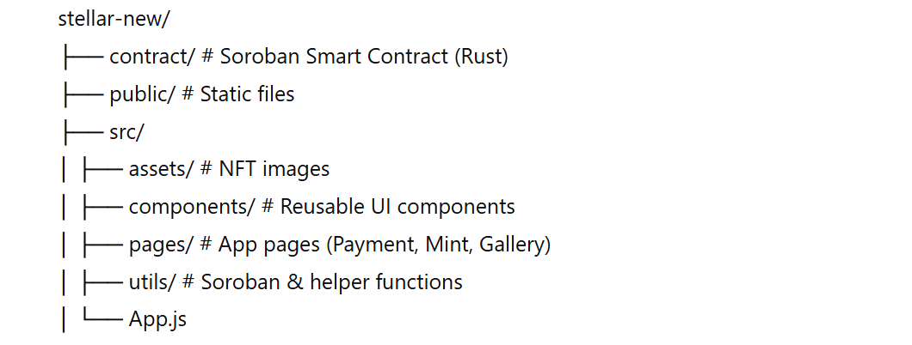

# 🚀 Stellar Payment & NFT dApp
### Level 1 + Level 2 Submission

## 📌 Overview
This project is a decentralized application built on the Stellar Testnet.
It demonstrates:
- Wallet integration
- XLM payment functionality
- Soroban smart contract deployment
- NFT minting
- Real-time transaction lifecycle
- NFT gallery

The app combines **Level 1 (Payments)** and **Level 2 (Smart Contract + NFT)** into one complete working dApp.

---

##  Level 1 – Payment dApp

### Features
- Connect Freighter wallet
- Display XLM balance
- Send XLM to any valid Stellar address
- Transaction status tracking
- **Error handling:**
  - Invalid address
  - Insufficient balance
  - User rejected transaction
  - Network failure

---

##  Level 2 – NFT Minter (Soroban Smart Contract)

### Features
- Smart contract deployed on Testnet
- Contract called from frontend
- Mint NFT with metadata (name + image ID)
- **Real-time transaction status:**
  - Waiting for wallet confirmation
  - Pending
  - Success
  - Failed
- NFT preview after mint
- NFT Gallery page
- Explorer verification link

---

## 🛠 Tech Stack
- React
- Stellar SDK
- Soroban RPC
- Freighter Wallet API
- Stellar Testnet
- Rust (Smart Contract)

---

##  Smart Contract Details

**Contract Address:**
```
CDEJPGZHERJIEP44Q5BDM44GJL4NVLXOGH4SNANZJUZODQPU75YF3FUR
```
---

## 🔎 Verified Transaction Example

**Transaction Hash:**
```
 a3c9a97672597dc4c1b9d2b65a9ca31fa6d155e0fbbe415c09993328e1fae703
```

**Explorer Link:**
https://stellar.expert/explorer/testnet/tx/a3c9a97672597dc4c1b9d2b65a9ca31fa6d155e0fbbe415c09993328e1fae703

---

## 📸 Screenshots

### Wallet & Payment Page


### NFT Mint Success
.png>)


### NFT Gallery Page


---

## Project Structure


## 🚀 Installation

### 1. Clone Repository
```bash
git clone https://github.com/pratikshakalbhor/stellar-whitebelt-dapp
cd stellar-new
```

### 2. Install Dependencies
```bash
npm install
```

### 3. Create .env.local
```env
REACT_APP_CONTRACT_ID= 
```

### 4. Start App
```bash
npm start
```

---

## 📊 Level 1 Checklist
- [x] Wallet integration
- [x] XLM payment
- [x] Transaction status
- [x] Error handling

## 📊 Level 2 Checklist
- [x] Contract deployed on Testnet
- [x] Contract called from frontend
- [x] NFT minting
- [x] Real-time transaction status
- [x] NFT Gallery
- [x] Verifiable transaction hash
- [x] Minimum 2 meaningful commits

---

## 🎯 Learning Outcomes
- Stellar transaction building & signing
- Soroban contract interaction
- Wallet lifecycle handling
- Error management in Web3 apps
- Full dApp architecture

---

**Built for Stellar Developer Track**
**Level 1 + Level 2 Submission 🚀**
